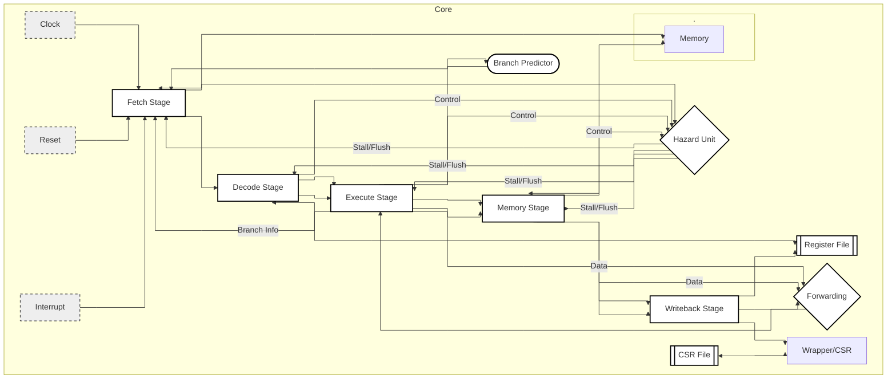

# VenomCPU
## Overview

- RISC-V RV32I Zicsr ISA
- In-Order 5-Stage Pipeline
- 76 Test RISCOF Verified 
- Decoupled Memory For External RAM
- Hardwired M-Mode Execution

## Supported CSR Reference Table
| CSR       | ACCESS | NOTES                                 |
|-----------|--------|---------------------------------------|
| MSTATUS   | MRW    | Only MRW Bits 3 + 7. M-Mode Hardwired |
| MEPC      | MRW    | Word Align Mask                       |
| MCAUSE    | MRW    | Includes Misalignment Traps           |
| MTVAL     | MRW    | Standard                              |
| MIE       | MRW    | Only MRW Bits 3 + 7 + 11              |
| MTVEC     | MRW    | Word Align Mask + Direct Mode Only    |
| MSCRATCH  | MRW    | Standard                              |
| MISA      | MRO    | RV32I                                 |
| MVENDORID | MRO    | Standard                              |
| MARCHID   | MRO    | Stadard                               |
| MIP       | MRW    | Writes Ignored But Don't Trap         |
| MCYCLE    | MRW    | Writes Override Hardware Incriments   |
| MINSTRET  | MRW    | Writes Override Hardware Incriments   |

## Dataflow Chart

